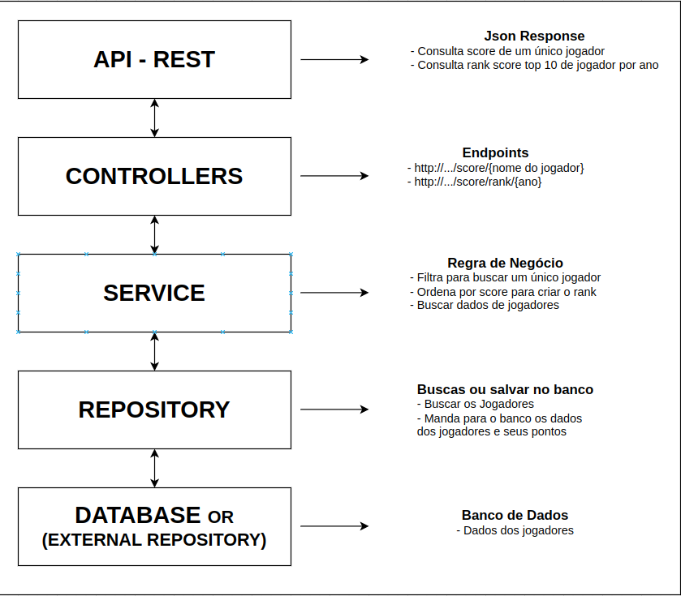

# <h1 align="center">  API to display soccer players' scores </h1>

<p align="center">

</p>


<p align="center">

 
 </p>

<h3 align="center"> This application has the initial objective of listing the scores of the players, separated by rank or by a single player..

Being possible rankings by their points, so the user can base himself for future decisions.

</h3>

<p align="center">

</p>

<br>

## Architecture

### For this project, the "Layered Architecture" was chosen, where it will be done following her concepts.

#### Pattern Description ( By [O’Reilly Media - Layered Architecture](https://www.oreilly.com/library/view/software-architecture-patterns/9781491971437/ch01.html) )

<h5>
"Components within the layered architecture pattern are organized into horizontal layers, each layer
performing a specific role within the application (e.g., presentation logic or business logic).
Although the layered architecture pattern does not specify the number and types of layers that must
exist in the pattern, most layered architectures consist of four standard layers: presentation,
business, persistence, and database (Figure 1-1). In some cases, the business layer and persistence
layer are combined into a single business layer, particularly when the persistence logic (e.g., SQL
or HSQL) is embedded within the business layer components. Thus, smaller applications may have only
three layers, whereas larger and more complex business applications may contain five or more layers."
</h5>

<h3>

How it will be distributed in layered architecture in this project.
<br>


</h3>

## Programation

This API will be REST and will use Java with [Quarkus](https://quarkus.io/)

## Running the application in dev mode

You can run your application in dev mode that enables live coding using:

```shell script
./mvnw compile quarkus:dev
```

> **_NOTE:_**  Quarkus now ships with a Dev UI, which is available in dev mode only
> at http://localhost:8080/q/dev/.

## Packaging and running the application

The application can be packaged using:

```shell script
./mvnw package
```

<div>
  <h6>Credits: 
  @book{
     title={CaRtola: Extração de dados da API do CartolaFC, análise exploratória dos dados e modelos preditivos em R e Python}, 
     url={https://github.com/henriquepgomide/caRtola}, 
     abstractNote={Extração de dados da API do CartolaFC, análise exploratória dos dados e modelos preditivos em R e Python}, 
     author={Gomide, Henrique and Gualberto, Arnaldo}, 
     year={2022}
}
</h6>
</div>


